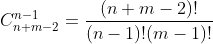

### [62. 不同路径-排列组合, 动态规划](https://leetcode-cn.com/problems/unique-paths/)

##### 题目描述

* 一个机器人位于一个 m x n 网格的左上角 (起始点在下图中标记为 "Start" ) 机器人每次只能向下或者向右移动一步. 机器人试图达到网格的右下角(在下图中标记为 "Finish" ). 问总共有多少条不同的路径?

    * 提示：

        - `1 <= m, n <= 100`
    - 题目数据保证答案小于等于 `2 * 10 ^ 9`
    * 示例:
    
        * ```example
            输入: m = 3, n = 2
            输出: 3
            解释:
            从左上角开始，总共有 3 条路径可以到达右下角。
            1. 向右 -> 向右 -> 向下
            2. 向右 -> 向下 -> 向右
            3. 向下 -> 向右 -> 向右
            ```


##### 思路一: 排列组合

* 如果, 向右移动一格用 0 表示, 向下移动一格用 1 来表示. 那么, 这道题就是看 m - 1 个 0 和 n - 1 个 1 能产生多少种不重复的排列组合.
    * 即在 n + m - 2 个位置里, m - 1 个 0 或 n - 1 个 1 有多少种不重复的排列方式?
        * 

```javascript
/**
 * @param {number} m
 * @param {number} n
 * @return {number}
 */
var uniquePaths = function (m, n) {
    return factorial_recursion (n + m - 2) / (factorial_recursion (n - 1) * factorial_recursion (m - 1));
};
var factorial_recursion = (i) => {
    if (i <= 1) return 1;
    return i * factorial_recursion (i - 1);
}
```


##### 复杂度分析

* 时间复杂度: O(n + m). 递归求阶乘的最大深度为 n + m - 2 .
* 空间复杂度: O(1).


##### 思路, 程序参考

* [powcai: 62. 不同路径](https://leetcode-cn.com/problems/unique-paths/solution/dong-tai-gui-hua-by-powcai-2/)
* [嘻嘻哈哈学习: 面试题之 Javascript 实现 1 万的阶乘](https://juejin.im/post/6844903949737164814)
* [百度知道: 排列组合问题 A 与 C 的计算公式](https://zhidao.baidu.com/question/67693764.html)


##### 思路二: 动态规划

* 机器人只能向下或向右移动, 所以:

* 到当下格子的走法 = 到其上方格子的路径数 + 到其左方格子的路径数.
    * `dp[ i ][ j ] = dp[ i - 1 ][ j ] + dp[ i ][ j - 1 ]`
    * `dp` 矩阵的最上一行与最左一列可初始化为 1 . 因为, 一直向下或一直向右不转向的话, 只有一种走法.

```javascript
/**
 * @param {number} m
 * @param {number} n
 * @return {number}
 */
var uniquePaths = function (m, n) {
    let dp = new Array(n);
    for (let i = 0; i < n; i ++) {
        dp[i] = new Array(m);
        dp[i][0] = 1;
    }
    for (let i = 0; i < m; i ++) {
        dp[0][i] = 1;
    }
    for (let i = 1; i < n; i ++) {
        for (let j = 1; j < m; j ++) {
            dp[i][j] = dp[i][j - 1] + dp[i - 1][j];
        }
    }
    return dp[n - 1][m - 1];
};
```


##### 复杂度分析

* 时间复杂度: O(n * m). `dp[i][j] = dp[i][j - 1] + dp[i - 1][j];` 运行了 ( n - 1 ) * ( m - 1 ) 次.
* 空间复杂度: O(n * m). 二维数组 `dp` 包含 `n` 个一维数组, 每个一维数组里有 `m` 个元素.


##### 思路, 程序参考

* [秦时明月: 62. 不同路径](https://leetcode-cn.com/problems/unique-paths/solution/62-bu-tong-lu-jing-by-alexer-660/)