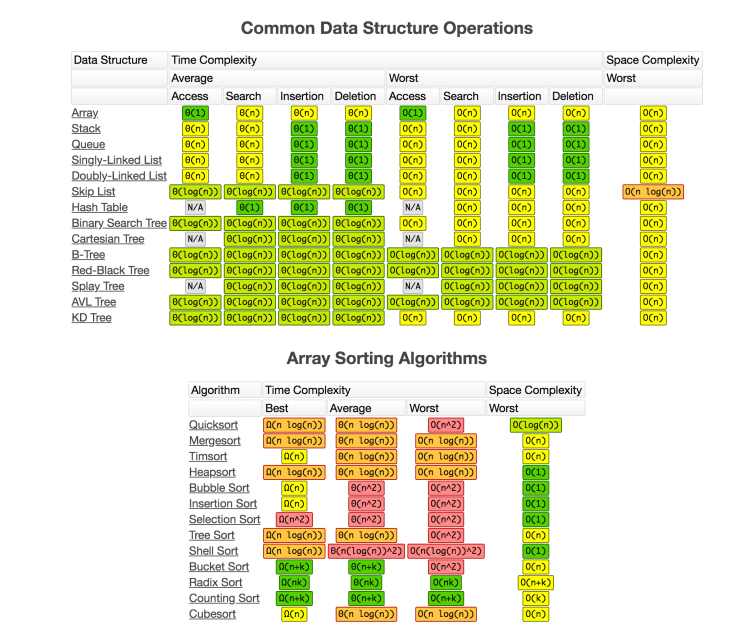

### [68.2 复杂度表](https://www.bigocheatsheet.com/)

    

    

    

##### 思路参考

* [覃超: 堆栈 & 队列](https://time.geekbang.org/course/detail/100019701-41553)

##### 图片来源:

* [Big-O Complexity Chart](https://www.bigocheatsheet.com/)