### 70.1 斐波拉且数列

##### 题目描述

<div align = center>
    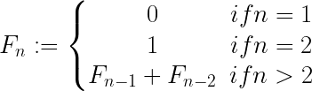
</div>


* 可以形成数列: 0  1  1  2  3  5  8  13  21  34  ...
    * 求数列中第 100 个数是多少?
    * 注意: 0 为该数列的第 1 个数, 不为第 0 个数.


##### 方法一: 递归

```javascript
/**
 * @param {number} n
 * @return {number}
 */
var fibonacciNumber = function (n) {
    let fib = function (n) {
        if (n == 0 || n == 1) {
            return n;
        }
        return fib(n - 1) + fib(n - 2);
    }
    return fib(99);
}
```


##### 方法二: 动态规划

```javascript
/**
 * @param {number} n
 * @return {number}
 */
var fibonacciNumber = function (n) {
    let fib = new Array(100);
    let fib[0] = 0;
    let fib[1] = 1;
    let i = 2;
    while (i < 100) {
        fib[i] = fib[i - 1] + fib[i - 2];
    }
    return fib[99];
}
```


##### 方法三: 公式

* 数列: 0, 1, 1, 2, 3, 5, 8, 13, 21, 34, ... (`a[n] = a[n - 1] + a[n - 2]`). 该数列的通项公式:
    * 注意: 通项公式中的 n 从 1 开始计数. 即 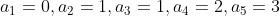

<div align = center>
    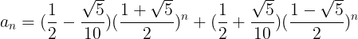
</div>


```javascript
/**
 * @param {number} n
 * @return {number}
 */
var fibonacciNumber = function (n) {
    let sqrtFive = Math.sqrt(5);
    let p = 1 / 2 - sqrtFive / 10;
    let q = 1 / 2 + sqrtFive / 10;
    let fibN = p * Math.pow((1 + sqrtFive) / 2, n) + p * Math.pow((1 - sqrtFive) / 2, n);
    return console.log(Math.round(res));
}
```

* 若第一, 第二个数为其它任意数(非负), 通项公式为何?

    * 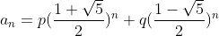
      
    * 将  带入其中, 可求得 p q

    * 把 p q 的值带入  中, 可得到该种情况下  的通项公式

    * 举例一

        * 数列: 0, 1, 1, 2, 3, 5, 8, 13, 21, 34, ... (`a[n] = a[n - 1] + a[n - 2]`)

        * 解得 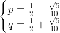

        * 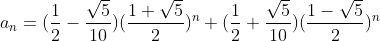

            * ```javascript
                /**
                 * @param {number} n
                 * @return {number}
                 */
                var fibonacciNumber = function (n) {
                    let sqrtFive = Math.sqrt(5);
                    let p = 1 / 2 - sqrtFive / 10;
                    let q = 1 / 2 + sqrtFive / 10;
                    let fibN = 0;
                    for (let i = 1; i <= n; i ++) {
                        fibN = p * Math.pow((1 + sqrtFive) / 2, i) + p * Math.pow((1 - sqrtFive) / 2, i);
                        console.log(Math.round(fibN));
                    }
                    return;
                };
                fibonacciNumber(10);
                
                /**
                 * std: 0  1  1  2  3  5  8  13  21  34
                 */
                ```

    * 举例二

        * 数列: 1, 2, 3, 5, 8, 13, 21, 34, ... (`a[n] = a[n - 1] + a[n - 2]`)
        
        * 解得 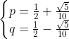
        
        * 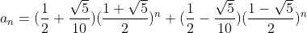
        
            * ```javascript
                /**
                 * @param {number} n
                 * @return {number}
                 */
                var fibonacciNumber = function (n) {
                    let sqrtFive = Math.sqrt(5);
                    let p = (5 + sqrtFive) / 10;
                    let q = (5 - sqrtFive) / 10;
                    let fibN = 0;
                    for (let i = 1; i <= n; i ++) {
                        fibN = p * Math.pow((1 + sqrtFive) / 2, i) + p * Math.pow((1 - sqrtFive) / 2, i);
                        console.log(Math.round(fibN));
                    }
                }
                fibonacciNumber(10);
                
                /**
                 * std: 1  2  3  5  8  13  21  34  55  89
                 */
                ```

* One more thing

    * 将 p q 用  表示, 并用程序模拟计算( n 从 1 开始计数)

        * 若数列的第一, 第二个数分别为 
        * 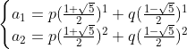
        * 解得
            * 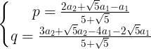

    * 进一步, 结合通项公式

        * 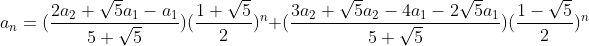

    * 程序

        * ```javascript
            /**
             * @param {number} aOne
             * @param {number} aTwo
             * @param {number} n
             * @return {number}
             */
            var oneStepFibonccia = function (aOne, aTwo, n) {
                let sqrtFive = Math.sqrt(5);
                let p = (2 * aTwo + sqrtFive * aOne - aOne) / (5 + sqrtFive);
                let q = (3 * aTwo + sqrtFive * aTwo - 4 * aOne - 2 * sqrtFive * aOne) / (5 + sqrtFive);
                let fibN = 0;
                for (let i = 1; i <= n; i ++) {
                    fibN = p * Math.pow((1 + sqrtFive) / 2, i) + p * Math.pow((1 - sqrtFive) / 2, i);
                    console.log(Math.round(fibN));
                }
                return;
            };
            oneStepFibonccia(0, 1, 10);
            
            /**
             * std: 0  1  1  2  3  5  8  13  21  34
             */
            ```


##### 题外话

* 公式法能成立是因为比例关系: 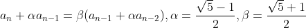
    * 这个比例关系为何成立? 不知道, 这个涉及到线性代数等其它的知识.
* 使用 `Math.round()` 方法, 最后得到的结果可能出现偏差.
    * 例如: 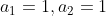 时
        * 输出数列: 0  1  2  3  5  8  13  21  34  55


##### 思路, 程序参考

* [zhaozhengcc: 数列特征方程](https://blog.csdn.net/bigtiao097/article/details/77113874)
    * 推导通项公式的方法来源于此

* [维基百科: 斐波那契数列](https://zh.wikipedia.org/wiki/%E6%96%90%E6%B3%A2%E9%82%A3%E5%A5%91%E6%95%B0%E5%88%97)

* [秦时明月: 70. 爬楼梯](https://leetcode-cn.com/problems/climbing-stairs/solution/70-pa-lou-ti-by-alexer-660/)

##### 图片来源

* chapter70.1.4 : [zhaozhengcc: 数列特征方程](https://blog.csdn.net/bigtiao097/article/details/77113874)
* chapter70.1.14: [斐波拉且数列](https://zh.wikipedia.org/wiki/%E6%96%90%E6%B3%A2%E9%82%A3%E5%A5%91%E6%95%B0%E5%88%97)

##### 公式编辑器

* [Codecogs](https://www.codecogs.com/latex/eqneditor.php?lang=zh-cn)